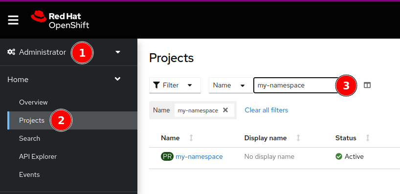

# Vertical Pod Autoscaler (VPA)

[Red Hat Documentation](https://docs.openshift.com/container-platform/latest/nodes/pods/nodes-pods-vertical-autoscaler.html)

## Installing the Operator (kustomize)

The [install directory](install) contains the kustomization configuration that can be used by a cluster administrator to install the operator in OpenShift 4.  Install it with the following command:

**Command Line**
```bash
cd install
oc apply -k .
```

## Monitoring Pods

The Vertical Pod Autoscaler (VPA) will monitor CPU and memory metrics and provide information on recommended requests and limits that should be set. A VPA object should be created for each object (Deployment, Stateful Set, Daemonset etc.) that should be monitored. There is an option to have the VPA automatically apply its recommendations at runtime, however the recommendation is to put the VPA in "monitor only" mode and make adjustments to the underlying deployment object instead. To create a VPA that monitors resource usage:

1. Identify the `Deployment` object to be monitored

    **Command Line**
    ```bash
    oc get deployments -n my-namespace

    NAME    READY   UP-TO-DATE   AVAILABLE   AGE
    myapp   1/1     1            1           3d
    ```

    **OpenShift UI**

    1. From the **Administrator** view`(1)` select **Projects**`(2)` then type the name of your project in the filter field `(3)` and click the name.
    
    2. Select the **Deployment**`(1)` inventory item 
    
    3. Make a note of the deployment name`(1)`
    

2. Create a VPA Object YAML file substituting the name retrieved above, e.g.

    [myapp-vpa.yaml](vpa-example.yaml) Contents:
    ```yaml
    apiVersion: autoscaling.k8s.io/v1
    kind: VerticalPodAutoscaler
    metadata:
      name: myapp-vpa-recommender
    spec:
      targetRef:
        apiVersion: "apps/v1"
        kind: Deployment
        name: myapp
      updatePolicy:
        updateMode: "Off"
    ```

    > **_NOTE:_**  Setting the `updateMode` to `Off` will allow the VPA to recommend resource values without actually applying those values to the running pods.

3. Create the VPA object

    **Command Line**
    ```bash
    oc apply -f myapp-vpa.yaml -n my-namespace
    ```

    **OpenShift UI**
    
    1. Select the + icon`(1)` in the upper right hand corner then either paste the contents of the YAML file into the editor window `(2)` or drag the YAML file into the editor window. Press the *Create*`(3)` button.
    


4. Verify the VPA object was created successfully

    **Command Line**
    ```bash
    oc get vpa -n my-namespace
    
    NAME                    MODE   CPU   MEM       PROVIDED   AGE
    myapp-vpa-recommender   Off    12m   131072k   True       3d
    ```

    **OpenShift UI**
    
    After creating the VPA, you should be brought to a page showing the status of the VPA


5. After about a minute recommendations will be available from the VPA object. Retrieve them as follows:

   **Command Line**
   ```bash
   oc get vpa myapp-vpa-recommender -n my-namespace -o yaml

   ...
       containerRecommendations:
    - containerName: appcontainer
      lowerBound:
        cpu: 12m
        memory: 131072k
      target:
        cpu: 12m
        memory: 131072k
      uncappedTarget:
        cpu: 12m
        memory: 131072k
      upperBound:
        cpu: 20m
        memory: "235109109"
   ```

   **OpenShift UI**

    Click the *YAML*`(1)` tab and view the recommendation`(2)` section
    

   This information should be used in conjunction with OpenShift metric data retrieved during application load testing to pick reasonable default CPU and memory resource values.


---
> **_NOTE:_**  To view the VPAs via the UI navigate to the following URL, replacing `<OPENSHIFT URL>` with the OpenShift console domain name and `<NAMESPACE>` with your project Namespace:
>
>```
>https://<OPENSHIFT URL>/k8s/ns/<NAMESPACE>/autoscaling.k8sio~v1~VerticalPodAutoscaler
>```

---
